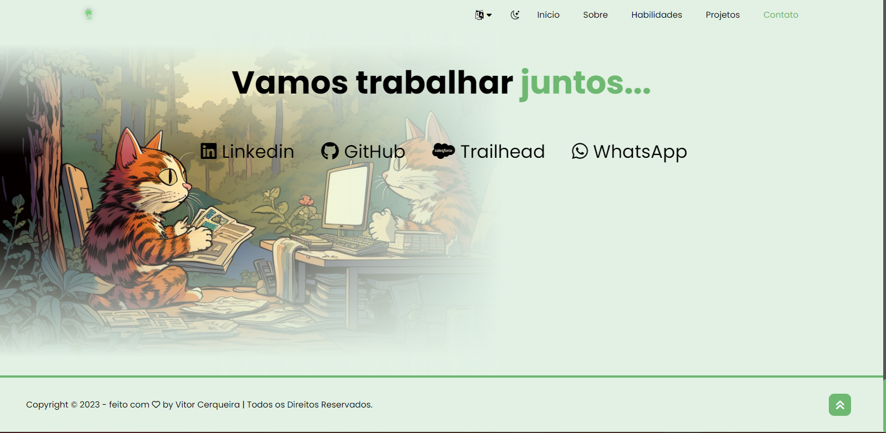

# Meu Portfólio

Bem-vindo ao meu projeto de portfólio! Este é um site pessoal onde compartilho informações sobre mim, meus projetos e habilidades. O projeto foi desenvolvido usando HTML, CSS e JavaScript.

## Visão Geral

Este projeto foi criado para exibir de forma eficaz o meu portfólio online. Ele inclui as seguintes características:

- Uma página inicial que destaca minhas informações pessoais e principais habilidades.
- Uma seção de projetos que exibe uma seleção dos meus trabalhos anteriores.
- Um mecanismo de navegação suave para acessar diferentes seções da página.
- Responsividade para garantir uma experiência agradável em dispositivos móveis.

## Demonstração

https://vitor-portifolio-eosin.vercel.app/

## Tecnologias Utilizadas

- HTML: Estruturação do conteúdo.
- CSS: Estilização e layout.
- JavaScript: Funcionalidades interativas e animações.

## Como Usar

1. Clone este repositório para a sua máquina local.
2. Abra o arquivo `index.html` no seu navegador preferido para visualizar o site.

## Screenshots

## Contato

Se você quiser entrar em contato comigo ou saber mais sobre o meu trabalho, você pode me encontrar em:

- Email: [damassa.dan@gmail.com](mailto:vitor94.cerqueira@gmail.com)
- LinkedIn: [Vitor Cerqueira](https://www.linkedin.com/in/vitor-cerqueira-dos-santos-89768b147/)

Sinta-se à vontade para explorar o meu portfólio e conhecer os meus projetos. Obrigado por visitar!
